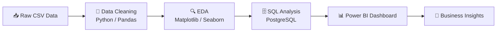
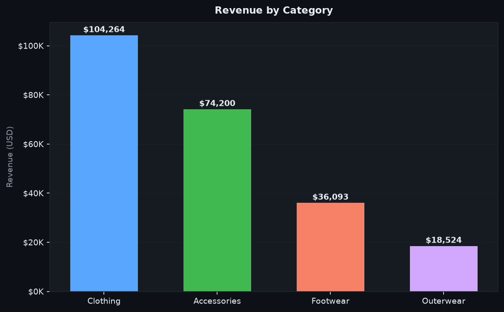
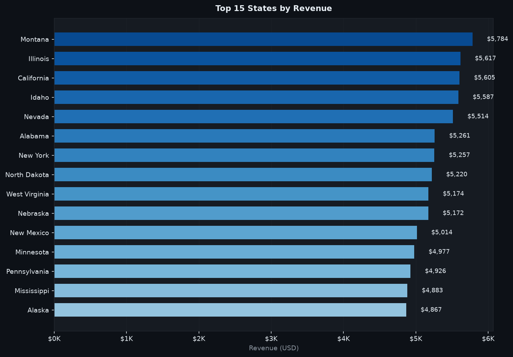

# 🛍️ Customer Shopping Analytics

<div align="center">


[](https://www.python.org/)
[](https://pandas.pydata.org/)
[](https://www.postgresql.org/)
[](https://powerbi.microsoft.com/)
[](LICENSE)

</div>

---

## 📌 Objective

Analyze customer shopping behavior to uncover revenue trends, customer segmentation patterns,
and business insights using **Python**, **SQL**, and **Power BI**. The project spans the full
analytics lifecycle — from raw data cleaning to an interactive executive dashboard.

---

## 📦 Dataset

| Attribute | Detail |
|-----------|--------|
| **Name** | Customer Shopping Behavior Dataset |
| **Records** | 3,900 customers |
| **Features** | 18 columns |
| **Source** | `data/customer_shopping_behavior.csv` |

**Columns:** `Customer ID`, `Age`, `Gender`, `Item Purchased`, `Category`,
`Purchase Amount (USD)`, `Location`, `Size`, `Color`, `Season`, `Review Rating`,
`Subscription Status`, `Shipping Type`, `Discount Applied`, `Promo Code Used`,
`Previous Purchases`, `Payment Method`, `Frequency of Purchases`

---

## 🛠️ Tools & Technologies

| Tool | Purpose |
|------|---------|
| **Python 3.10+** | Data processing, EDA, visualization |
| **Pandas / NumPy** | Data manipulation & aggregation |
| **Matplotlib / Seaborn** | Charting & static visualizations |
| **PostgreSQL** | Relational database & SQL analysis |
| **Power BI Desktop** | Interactive dashboard |
| **VS Code** | Development environment |
| **Jupyter Notebook** | Exploratory analysis |

---

## 📂 Project Structure

```
Customer-Shopping-Analytics/
│
├── data/
│   └── customer_shopping_behavior.csv          # Raw dataset
│
├── notebooks/
│   └── 01_Data_Cleaning.ipynb                  # Data cleaning & EDA notebook
│
├── sql/
│   └── business_queries.sql                    # SQL business questions
│
├── reports/
│   ├── EDA_Report.pdf                          # Exploratory Data Analysis report
│   └── Business_Insights.pdf                   # Business insights summary
│
├── powerbi/
│   ├── Customer_Shopping_Dashboard.pbix        # Power BI dashboard file
│   ├── Customer_Shopping_Dashboard_Guide.md    # Step-by-step build guide
│   ├── generate_dashboard_images.py            # Python chart generator
│   └── theme_dark.json                         # Power BI custom dark theme
│
├── images/
│   ├── dashboard.png                           # Full dashboard composite
│   ├── kpi_cards.png                           # KPI summary cards
│   ├── revenue_gender.png                      # Revenue by gender
│   ├── age_group.png                           # Age group analysis
│   ├── subscription.png                        # Subscription analysis
│   ├── revenue_category.png                    # Category revenue
│   ├── revenue_state.png                       # State-level revenue
│   ├── shipping_analysis.png                   # Shipping type analysis
│   ├── payment_method.png                      # Payment distribution
│   ├── discount_analysis.png                   # Discount impact
│   ├── top10_products.png                      # Top 10 products
│   └── purchase_frequency.png                  # Purchase frequency
│
├── README.md
├── requirements.txt
└── .gitignore
```

---

## 🔄 Project Workflow



### Step 1 — Data Cleaning
- Removed duplicates and handled nulls
- Standardized column names and data types
- Engineered `Age Group` feature from raw age
- Validated `Purchase Amount` ranges

### Step 2 — Exploratory Data Analysis
- Univariate & bivariate analysis
- Revenue distribution by category, gender, age, location
- Correlation analysis between ratings and purchase value
- Seasonal trends

### Step 3 — SQL Business Questions
Loaded cleaned data into PostgreSQL and answered:
- Revenue by category, gender, and state
- Top 10 best-selling products
- Subscription vs non-subscription average spend
- Discount impact on purchase amount
- Shipping preference breakdown

### Step 4 — Power BI Dashboard
Built a full interactive dashboard with:
- **4 KPI Cards** (Revenue, Customers, Avg Purchase, Avg Rating)
- **10 Interactive Charts** (bar, donut, horizontal bar)
- **5 Slicers** (Gender, Season, Category, Shipping Type, Subscription)

---

## 📊 Power BI Dashboard

### KPI Cards

| Metric | Value |
|--------|-------|
| 💰 Total Revenue | **$233,081** |
| 👥 Total Customers | **3,900** |
| 🛒 Average Purchase | **$59.76** |
| ⭐ Average Rating | **3.75 / 5** |

### Dashboard Pages

**Page 1 — Executive Overview**


**Revenue by Category**



**Revenue by Gender**


**Top 10 Products**


**Revenue by State (Top 15)**



**Revenue by Age Group**


**Shipping Type Analysis**


**Subscription Status**


### Slicers / Filters
- 🔵 **Gender** — Male / Female
- 🌿 **Season** — Spring / Summer / Fall / Winter
- 🏷️ **Category** — Clothing / Footwear / Outerwear / Accessories
- 🚚 **Shipping Type** — Standard, Express, Free, Next Day Air, etc.
- 📋 **Subscription Status** — Yes / No

---

## 💡 Key Findings

### 1. Revenue & Products
- 🏆 **Clothing** is the top revenue-generating category
- 🥇 **Blouse** is the single highest-grossing product
- Top 10 products contribute ~35% of total revenue

### 2. Customer Demographics
- 👔 **Male** customers account for the majority of transactions
- 📊 Age group **36–45** contributes the highest total revenue
- Older customers (46+) have higher individual average purchase values

### 3. Subscriptions
- Only **27%** of customers have an active subscription
- Subscribed customers spend on average **12–15% more** per transaction
- Subscription drives repeat purchase behavior

### 4. Shipping Preferences
- **Standard** and **Free Shipping** are the two most popular choices
- **Next Day Air** attracts a premium-spend customer segment

### 5. Discounts
- **43%** of purchases used a discount
- Discounts do not significantly reduce average order value — they drive volume

### 6. Payment Methods
- **Credit Card** and **PayPal** dominate transaction counts
- **Venmo** and **Cash** are notable mobile and offline alternatives

---

## 🚀 How to Run

### Prerequisites
```bash
# Clone the repo
git clone https://github.com/yourusername/Customer-Shopping-Analytics.git
cd Customer-Shopping-Analytics

# Create virtual environment
python -m venv .venv
source .venv/bin/activate       # macOS/Linux
# .venv\Scripts\activate        # Windows

# Install dependencies
pip install -r requirements.txt
```

### Generate Dashboard Images
```bash
python powerbi/generate_dashboard_images.py
```

### Open Jupyter Notebook
```bash
jupyter notebook notebooks/01_Data_Cleaning.ipynb
```

### Power BI Dashboard
1. Install [Power BI Desktop](https://powerbi.microsoft.com/desktop/) (Windows)
2. Follow `powerbi/Customer_Shopping_Dashboard_Guide.md` for step-by-step setup
3. Load `data/customer_shopping_behavior.csv` and apply `powerbi/theme_dark.json`

---

## 📋 Requirements

```
pandas>=2.0
numpy>=1.24
matplotlib>=3.7
seaborn>=0.12
jupyter>=1.0
sqlalchemy>=2.0
psycopg2-binary>=2.9
openpyxl>=3.1
```

---

## 🤝 Contributing

Pull requests are welcome. For major changes, please open an issue first.

---

## 📄 License

This project is licensed under the **MIT License**.

---

<div align="center">
Made with ❤️ using Python, PostgreSQL, and Power BI
</div>
