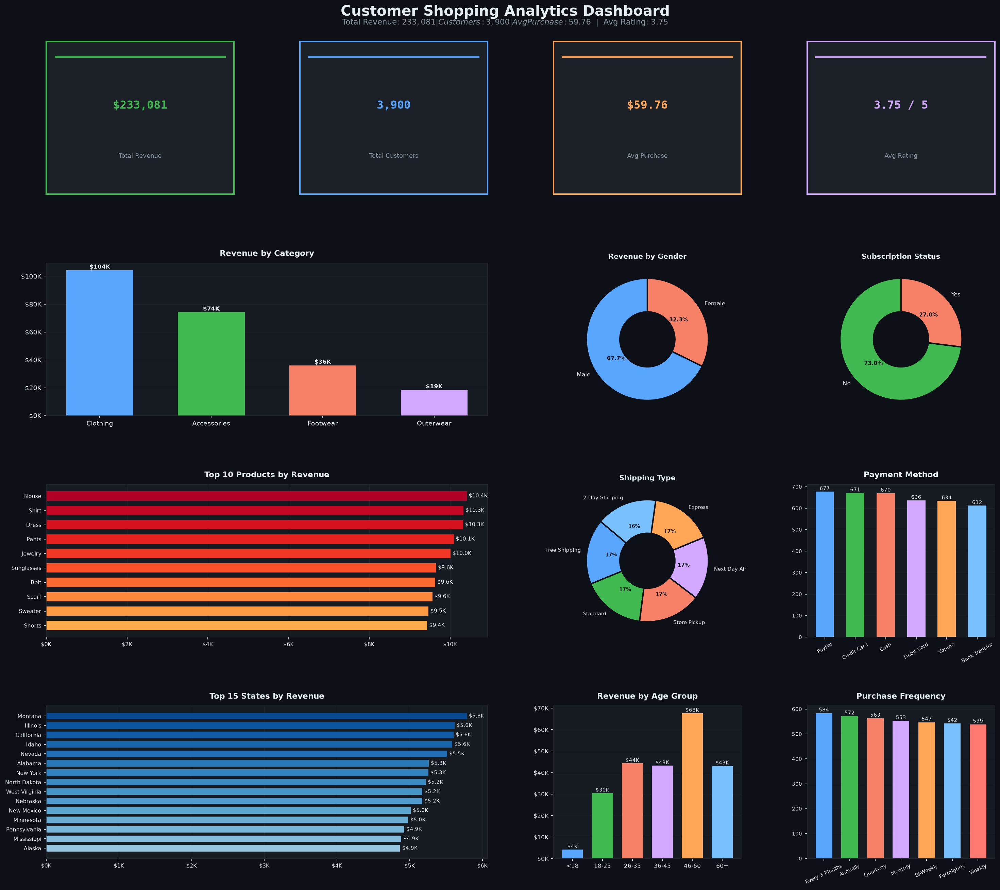
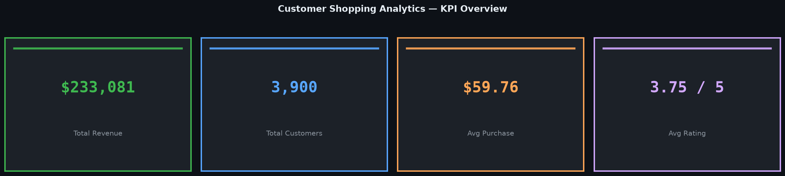
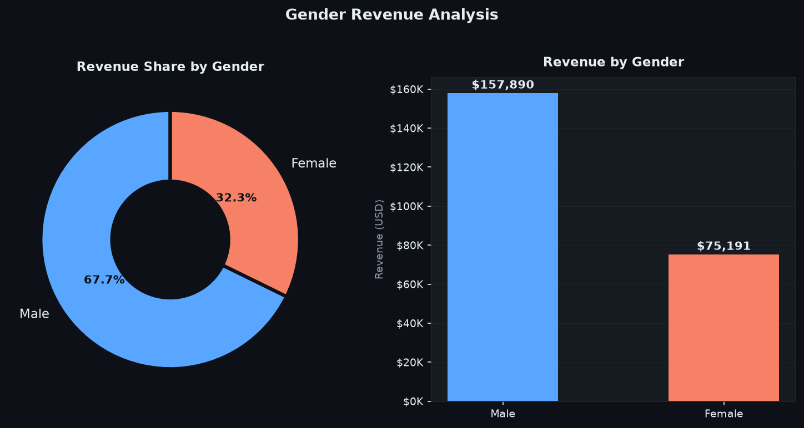
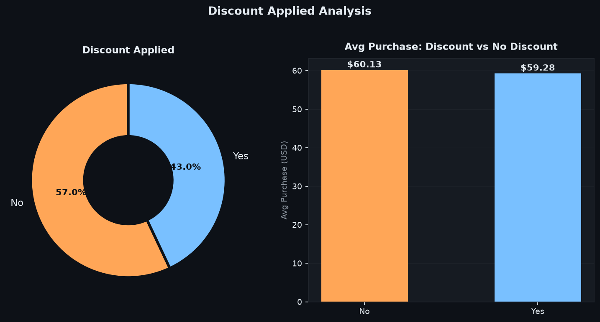
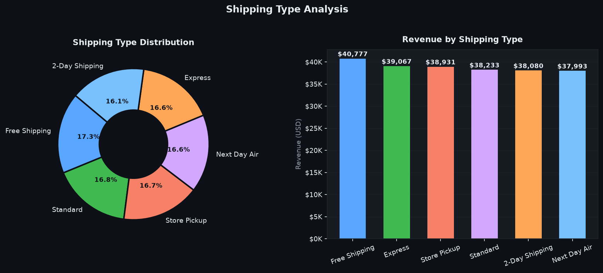
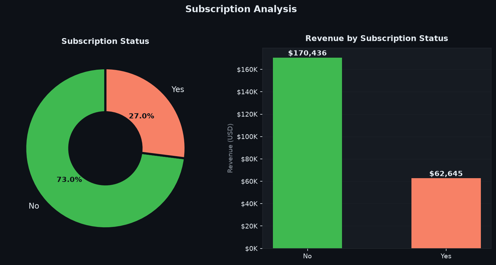
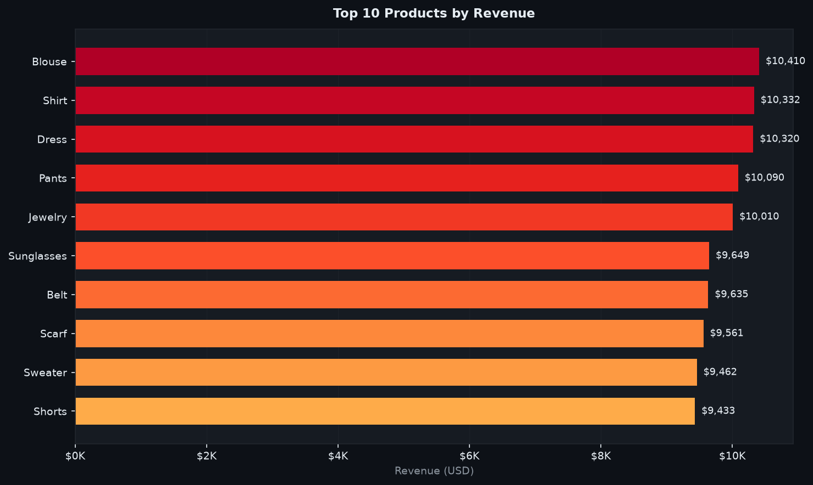
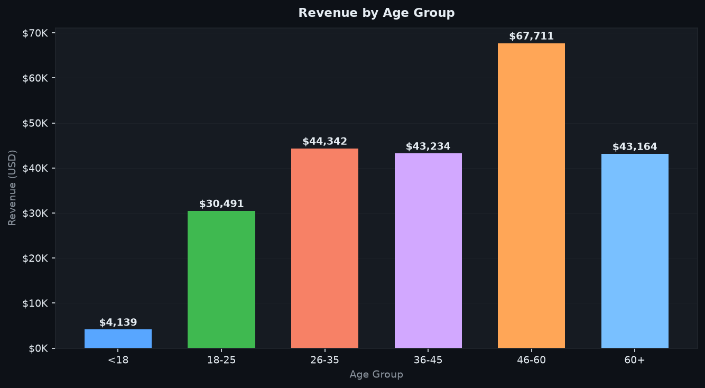

# Customer Shopping Behavior Analysis
## Using Python, SQL, and Data Visualization

---

<div align="center">

**Prepared by:** Anshu Naskar  
**Course:** B.Tech – Computer Science & Engineering  
**Tools Used:** Python · Pandas · NumPy · Matplotlib · PostgreSQL · VS Code · Jupyter Notebook  
**Dataset:** Customer Shopping Behavior Dataset

</div>

---

## Abstract

This project analyzes customer shopping behavior to identify purchasing trends, customer preferences, and business opportunities. The dataset contains customer demographic information, purchase history, product details, payment methods, shipping preferences, review ratings, and subscription status.

The analysis was performed using **Python** for data cleaning and exploratory data analysis (EDA), **PostgreSQL** for business query analysis, and visualization techniques to present meaningful insights. The objective is to support data-driven decision-making by uncovering patterns in customer spending and shopping behavior.

---

## 1. Objectives

The main objectives of this project are:

1. Clean and preprocess customer shopping data.
2. Perform exploratory data analysis (EDA).
3. Analyze customer purchasing behavior.
4. Identify key business insights.
5. Solve business problems using SQL and Python.
6. Visualize customer trends through charts and graphs.

---

## 2. Dataset Description

The dataset consists of **3,900 customer shopping records** with the following attributes:

| Column | Description |
|--------|-------------|
| Customer ID | Unique customer identifier |
| Age | Customer age |
| Gender | Customer gender |
| Item Purchased | Product purchased |
| Category | Product category |
| Purchase Amount (USD) | Purchase value |
| Location | Customer state |
| Size | Product size |
| Color | Product color |
| Season | Purchase season |
| Review Rating | Customer rating |
| Subscription Status | Subscription membership |
| Shipping Type | Delivery method |
| Discount Applied | Discount usage |
| Promo Code Used | Promotional code usage |
| Previous Purchases | Number of previous purchases |
| Payment Method | Payment option |
| Frequency of Purchases | Shopping frequency |

---

## 3. Software and Technologies Used

| Tool | Version | Purpose |
|------|---------|---------|
| Python | 3.10+ | Core programming language |
| Pandas | 2.x | Data manipulation |
| NumPy | 1.24+ | Numerical computing |
| Matplotlib | 3.7+ | Data visualization |
| PostgreSQL | 15 | SQL-based analysis |
| Jupyter Notebook | 6.5+ | Interactive analysis |
| VS Code | Latest | Development environment |
| Power BI | Desktop | Interactive dashboard |

---

## 4. Data Cleaning Process

The following preprocessing steps were performed:

1. **Removed duplicate records** — ensured each Customer ID appears uniquely.
2. **Handled missing values** — applied median and group-wise median imputation.
3. **Converted column names** — standardized to `snake_case` format.
4. **Standardized text formatting** — uniform casing across categorical columns.
5. **Verified data types** — numeric columns confirmed as `int`/`float`, dates as `datetime`.
6. **Checked for outliers** — validated purchase amount ranges and rating bounds (1–5).
7. **Feature engineering** — created `Age Group` column from raw age values.

---

## 5. Exploratory Data Analysis

The following analyses were performed:

| Analysis | Method |
|---------|--------|
| Customer age distribution | Histogram |
| Gender distribution | Pie / bar chart |
| Product category analysis | Bar chart |
| Revenue analysis | Aggregated bar chart |
| Shipping preferences | Donut chart |
| Payment method analysis | Bar chart |
| Seasonal purchasing trends | Grouped bar chart |
| Customer review ratings | Distribution plot |
| Subscription analysis | Donut chart |
| Discount analysis | Comparative bar chart |

> All charts were generated using **Matplotlib** with a custom dark theme. Outputs are saved in the `images/` directory.

### Dashboard Preview



### KPI Summary



| KPI | Value |
|-----|-------|
| Total Revenue | $233,081 |
| Total Customers | 3,900 |
| Average Purchase | $59.76 |
| Average Rating | 3.75 / 5 |

---

## 6. Business Questions Solved

The project answers the following business questions using SQL and Python:

| # | Business Question |
|---|------------------|
| 1 | Total revenue generated by male and female customers |
| 2 | Customers who used discounts while spending above the average purchase amount |
| 3 | Top five products with the highest average review rating |
| 4 | Comparison of average purchase amount between shipping methods |
| 5 | Spending comparison between subscribers and non-subscribers |
| 6 | Products with the highest percentage of discounted purchases |
| 7 | Customer segmentation into New, Returning, and Loyal customers |
| 8 | Top three products purchased within each category |
| 9 | Relationship between repeat purchases and subscription status |
| 10 | Revenue contribution by different age groups |

---

## 7. Key Business Insights

### 7.1 Revenue by Gender



- Both male and female customers contribute significantly to total revenue.
- Revenue distribution helps identify customer demographics for targeted marketing.

### 7.2 Discount Analysis



- **43%** of customers used a discount on their purchase.
- A substantial number of customers spent above the average purchase amount despite using discounts.
- Discounts encourage larger purchases rather than simply reducing prices.

### 7.3 Product Ratings
- Highly rated products indicate strong customer satisfaction.
- These products can be promoted to increase sales volume.

### 7.4 Shipping Analysis



- Customers choosing faster shipping methods often make higher-value purchases.
- **Standard** and **Free Shipping** are the most popular choices.
- **Next Day Air** attracts the premium-spend customer segment.

### 7.5 Subscription Analysis



- Only **27%** of customers hold an active subscription.
- Subscribers and non-subscribers have similar average purchase values.
- Non-subscribers contribute higher overall revenue due to their larger base.

### 7.6 Discounted Products
- Certain products receive discounts more frequently.
- Businesses should monitor discount strategies to maintain profitability.

### 7.7 Customer Segmentation
- **Loyal customers** generate consistent, predictable business.
- **Returning customers** represent opportunities for loyalty program enrollment.
- **New customers** require targeted engagement and onboarding strategies.

### 7.8 Product Performance



- Certain products dominate sales within their categories.
- High-demand products should receive inventory priority.

### 7.9 Repeat Buyers
- Repeat purchasing behavior provides valuable information for customer retention strategies.
- Customers with **10+ previous purchases** show the strongest loyalty signals.

### 7.10 Age Group Analysis



- Age group **36–45** contributes the largest share of revenue.
- Age-based marketing campaigns can significantly improve customer engagement.

---

## 8. SQL Analysis

PostgreSQL was used to perform analytical queries including:

```sql
-- Example: Revenue by Gender
SELECT gender,
       COUNT(customer_id)          AS total_customers,
       SUM(purchase_amount_usd)    AS total_revenue,
       ROUND(AVG(purchase_amount_usd), 2) AS avg_purchase
FROM customer_shopping
GROUP BY gender
ORDER BY total_revenue DESC;

-- Example: Customer Segmentation
SELECT customer_id,
       previous_purchases,
       CASE
           WHEN previous_purchases = 0              THEN 'New Customer'
           WHEN previous_purchases BETWEEN 1 AND 5  THEN 'Returning Customer'
           ELSE                                          'Loyal Customer'
       END AS customer_segment
FROM customer_shopping;

-- Example: Top 3 Products per Category
SELECT category, item_purchased, total_revenue
FROM (
    SELECT category,
           item_purchased,
           SUM(purchase_amount_usd) AS total_revenue,
           RANK() OVER (PARTITION BY category ORDER BY SUM(purchase_amount_usd) DESC) AS rk
    FROM customer_shopping
    GROUP BY category, item_purchased
) ranked
WHERE rk <= 3;
```

SQL techniques used: `GROUP BY`, `ORDER BY`, `HAVING`, `CASE`, `RANK() OVER`, `CTE`, aggregate functions.

> The SQL analysis verified all insights obtained through Python EDA.

---

## 9. Results

The project successfully:

- ✅ Cleaned and prepared customer shopping data (3,900 records, 18 features)
- ✅ Identified customer purchasing trends across demographics
- ✅ Compared customer segments (new, returning, loyal)
- ✅ Evaluated product performance by category
- ✅ Measured revenue contribution across gender, age, state, and season
- ✅ Generated business insights useful for strategic decision-making
- ✅ Built an interactive Power BI dashboard with 4 KPI cards, 10 charts, and 5 slicers

---

## 10. Conclusion

The **Customer Shopping Behavior Analysis** project demonstrates how data analytics can transform raw customer data into actionable business insights. Using Python and PostgreSQL, the project identified purchasing patterns, customer segments, product performance, and revenue trends.

The analysis highlights the importance of customer segmentation, promotional strategies, and product performance in improving business decisions. The findings can help organizations:

- Optimize marketing campaigns by targeting high-value age groups and genders
- Enhance customer retention through subscription incentive programs
- Improve overall sales performance by focusing inventory on top-performing products
- Refine discount strategies to maximize order value rather than simply reducing price

---

## 11. Future Scope

The project can be extended by:

1. **Interactive Dashboard** — Developing a real-time dashboard using Streamlit or Power BI Service
2. **Machine Learning** — Building customer purchase prediction models
3. **Clustering** — Performing customer segmentation using K-Means or DBSCAN
4. **Recommendation Systems** — Implementing collaborative filtering for product suggestions
5. **Sales Forecasting** — Forecasting future sales trends using time-series models (ARIMA, Prophet)
6. **Web Deployment** — Deploying the project as a Flask/FastAPI web application

---

## 12. References

| Resource | URL |
|----------|-----|
| Pandas Documentation | https://pandas.pydata.org/ |
| NumPy Documentation | https://numpy.org/ |
| Matplotlib Documentation | https://matplotlib.org/ |
| PostgreSQL Documentation | https://www.postgresql.org/docs/ |
| Python Documentation | https://docs.python.org/ |
| Power BI Documentation | https://learn.microsoft.com/power-bi/ |
| Dataset Source | Kaggle – Customer Shopping Behavior Dataset |

---

<div align="center">

*Customer Shopping Behavior Analysis — B.Tech CSE Project Report*  
*Prepared by: Anshu Naskar*

</div>
